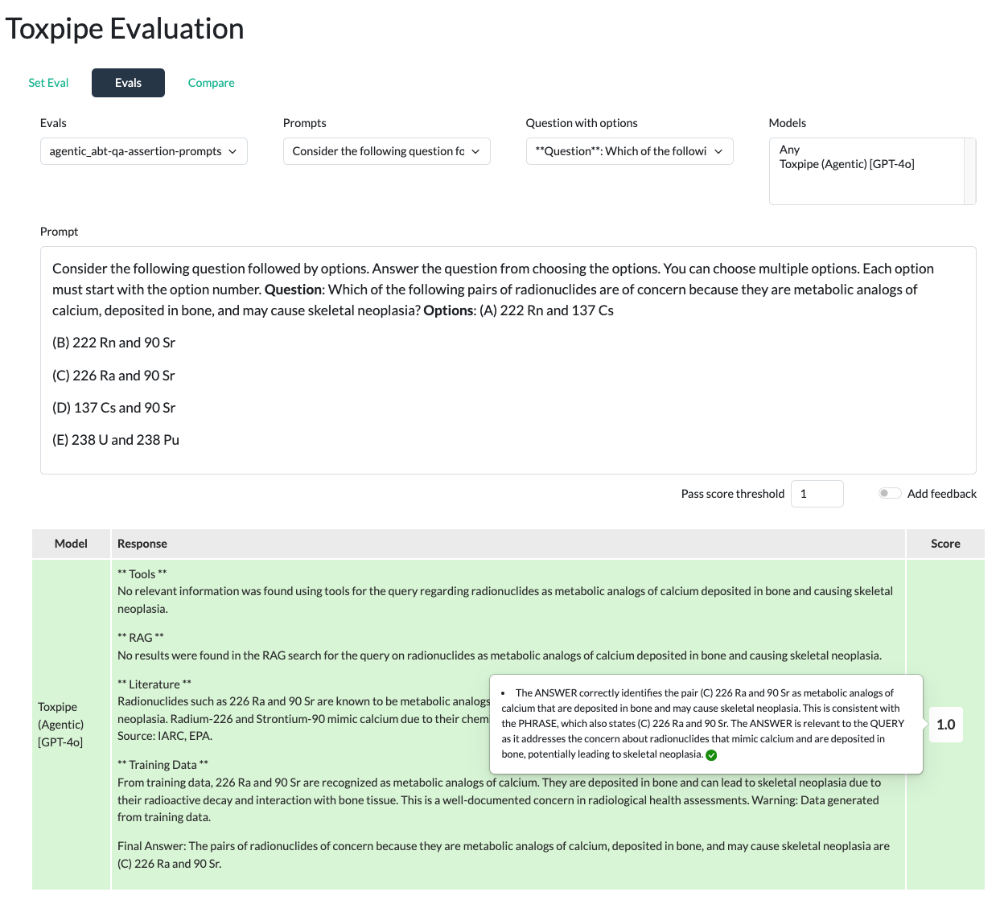
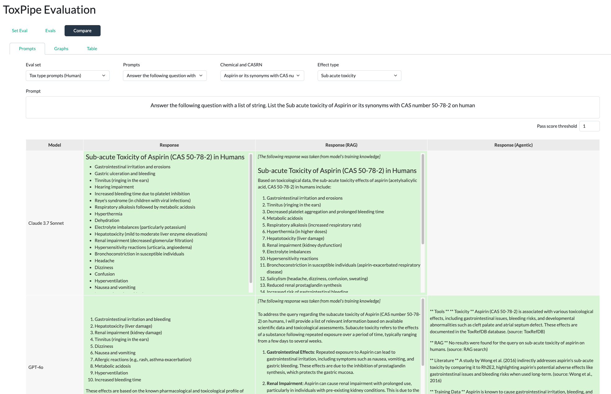
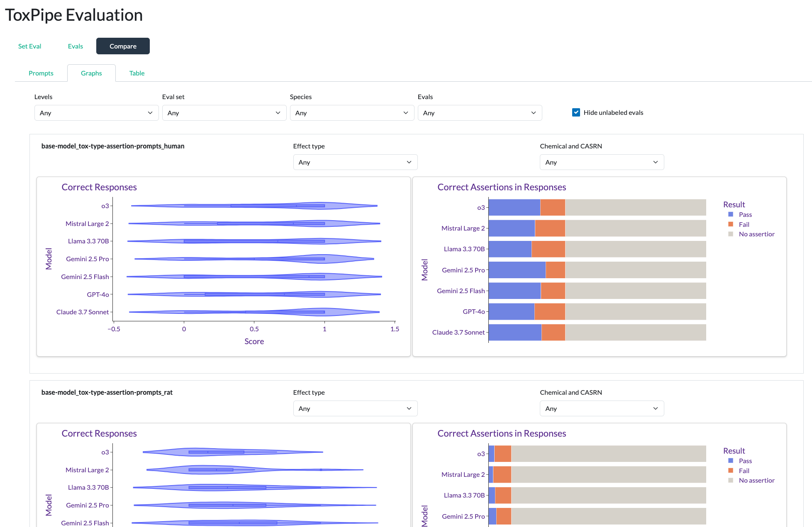

# Toxpipe Evaluation Application
Amlan Talukder
May 8, 2026

- [AI Model responses on the evaluation
  sets](#ai-model-responses-on-the-evaluation-sets)
- [Comparison between responses from different AI
  Models](#comparison-between-responses-from-different-ai-models)
- [Performance comparison](#performance-comparison)

ToxPipe evaluation sets, evaluation results and the responses of the AI
models are documented and compared in this
<a href="https://rstudio.niehs.nih.gov/tox-eval/"
target="_blank">link</a>

## AI Model responses on the evaluation sets

## Comparison between responses from different AI Models

## Performance comparison

