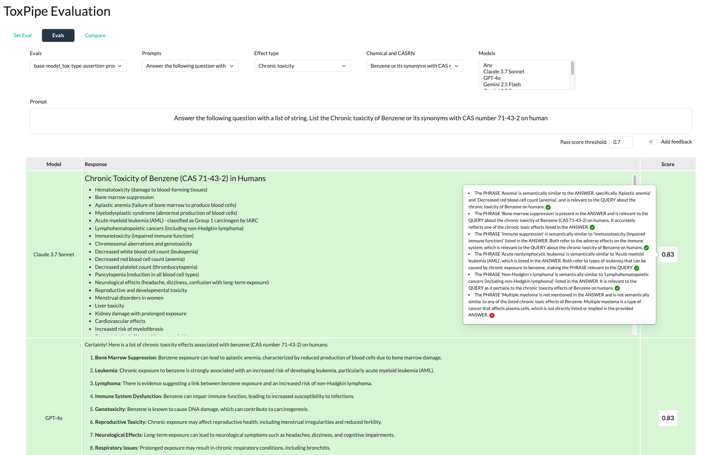

ToxPipe evaluation sets, evaluation results and the responses of the AI models are documented and compared in this [link](https://rstudio.niehs.nih.gov/tox-eval/){target="_blank"}

## AI Model responses on the evaluation sets

